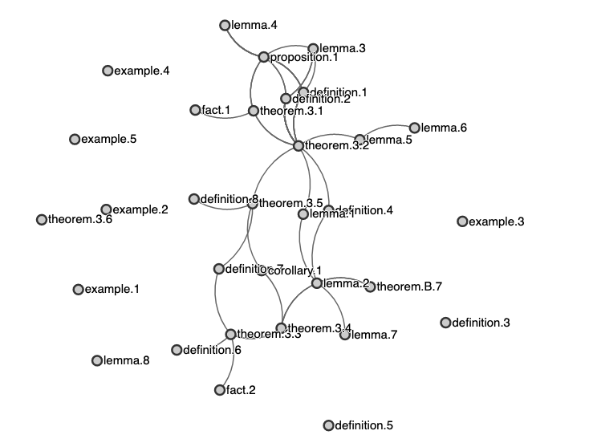

# rumbaa - RUst Mathematics Bloc Analysis for lAtex document

rumbaa is a mathematical analyzer for latex documents written in Rust.
The output of of rumbaa is graph displaying the dependencies between mathematical structures (*e.g.*, theorems, lemmas etc...)



## Installation - *Work in progress*

1. Make sure that Rust is available on your computer. Otherwise see [this link](https://www.rust-lang.org/tools/install).

2. Download repository
```
git clone https://github.com/c-elvira/rumbaa.git
```

3. Run the installation script
```
./install.sh
```

## Usage

1. Formating Latex document

**Latex environments:** rumbaa looks after the usual latex structures such as *Theorem*, *Proposition* etc... Your latex document should look like this:
``` latex
\newtheorem{theorem}{Theorem}[section]
\newtheorem{lemma}[theorem]{Lemma}
\newtheorem{proposition}[theorem]{Proposition}
\newtheorem{corollary}[theorem]{Corollary}

\begin{theorem}
    \label{th:my_label}
    ...
\end{theorem}

```
Note that several labels may appear in such a latex environment.
This is not an issue here.
However, the first one should be associated to the environment.


**Proofs:**
In order to create links between mathematical structures, rumbaa parses proofs.
Since a proof may not be right after its associated results, I recommend adding the following *latexmk*-like option in the proof environment:
``` latex
\begin{proof}
    %!TEX proof = {th:my_label}
    ...
\end{proof}
```


**Nested documents:** rumbaa can handle nested latex files. For now, only `\input{file}` is supported.


**Auxiliary files:** By default, rumbaa identifies a mathematical structure by its label. If the auxiliary files produced by latex (.aux) are found, rumbaa will parse them to improve visualization.

2. Terminal

In your terminal, call
```
    rumbaa my_document.tex
```
The outputs are
 * A html file called *index.html*. open it to see the mathematical structure of your document,
 * a json files containing the detected structures and links.

Options are:
 * -f, --folder: if the main latex file is not in the current directory,
 * -o, --output: to specify the output directory, 
 * -a, --aux: to specify the directory containing auxiliary files (may improve visualization). 


## Milestones

 - [x] Fist prototype: parse a multi-files latex document and display 
 - [ ] Use equation label to improve connections between mathematical structures
 - [ ] Use custom structures for latex (others than basic ones)
 - [ ] Improve output
 - [ ] Generate report
 - [ ] Unit testing


## Work in progress

This is still a work in progress so there's still bugs to iron out. As this is my first project in Rust the code could no doubt use an increase in quality but I'll be improving on it whenever I find the time. If you have any feedback feel free to raise an issue/submit a PR.

## Alternatives

If you known any alternative to rumbaa feel free to raise issue/submit a PR or send me a mail.

## License

rumbaa is licensed under the [MIT License](https://opensource.org/licenses/MIT).

